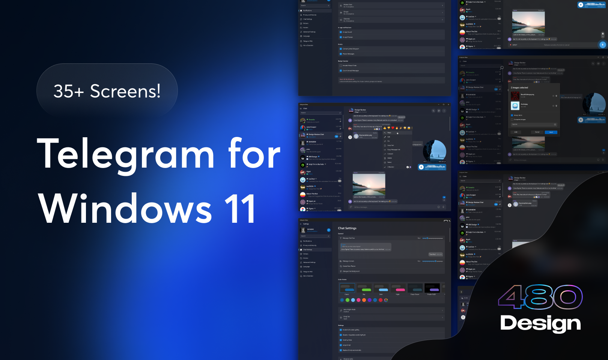

# Telegram-Clone

Telegram-Clone is a web-chat-application




## 🎯 Main Features

✅ Chat with every friend in your List

🔜 Changing the style of the the app (colors , font , backgrounds)

✅ Dark mode

🔜 Ask Chat GPT in the app about anySubject you Have

## ⚙ Installation steps

If you want to get the full project:

```
git clone https://github.com/BelkacemYerfa/Telegram
npm i && npm start
```

## 🎨 Figma Project

There is also a free Figma project for this app.

You can check it out from here: 
 https://www.figma.com/file/7nFSBvDiXYA3olcgZyfJSh/Telegram-for-Windows-11-(Community)?node-id=115%3A6455&t=KpDNl65jX5QRMa3f-0

## 🔨 Used packages

ReactJs, TailwindCss, UseContextApi, State Managment, gsap-react.

If you liked this project then kindly support it by giving it a star ⭐!
